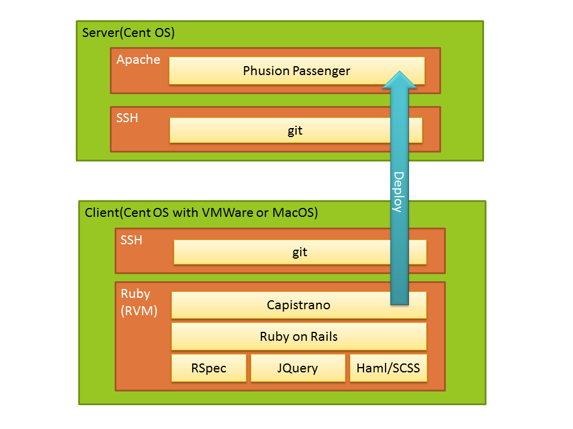

アプリケーションのデプロイ
========================================

Ruby on Railsを用いた開発
-------------------------

* Phusion Passenger
  - RailsアプリケーションをApacheに接続して動作させるためのモジュール
* Capistrano
  - SSH/gitを使って，RailsアプリケーションをPassengerに対してデプロイするためのツール

Railsアプリケーションのデプロイのためのツール
---------------------------------------------

- `Capistrano <https://github.com/capistrano/capistrano#readme>`_ のインストール

  .. code-block:: bash

    $ sudo gem install capistrano

- `Phusion Passenger <http://www.modrails.com/install.html>`_ のインストール

  .. code-block:: bash

    $ sudo gem install passenger

- Passengerをapacheと接続するためのモジュールをコンパイルする

  .. code-block:: bash

    $ sudo yum -y install gcc-c++ curl-devel openssl-devel zlib-devel httpd-devel apr-devel apr-util-devel
    $ sudo passenger-install-apache2-module

  以下の内容を/etc/httpd/conf.d/rails.confに記述する

  .. code-block:: apacheconf
  
    LoadModule passenger_module /usr/lib/ruby/gems/1.8/gems/passenger-3.0.11/ext/apache2/mod_passenger.so
    PassengerRoot /usr/lib/ruby/gems/1.8/gems/passenger-3.0.11
    PassengerRuby /usr/bin/ruby

    <VirtualHost *:80>
      ServerName localhost
      DocumentRoot /home/rails/myapp/current/public
      <Directory /home/rails/myapp/current/public>
         AllowOverride all
         Options -MultiViews
      </Directory>
    </VirtualHost>

- httpdを再起動する

  .. code-block:: bash

    $ sudo service httpd restart

railsユーザアカウントを作成する
-------------------------------

Railsのアプリケーションをデプロイする場所として，railsアカウントを作成してそのhomeを利用する．このhomeは，6770の設定をし，railsグループに所属するユーザからの参照・更新を許可する．

- railsユーザアカウントの設定

  .. code-block:: bash

    $ sudo /usr/sbin/useradd rails
    $ sudo chmod 6770 /home/rails/

- railsグループに，自分のユーザアカウントとapacheアカウントを追加する

  .. code-block:: bash

    $ sudo /usr/sbin/vigr

公開鍵でlocalhostにSSH接続できるようにする
~~~~~~~~~~~~~~~~~~~~~~~~~~~~~~~~~~~~~~~~~~
- 公開鍵をauthorized_keysに登録する

  .. code-block:: bash

    $ cat ~/.ssh/id_rsa.pub >> ~/.ssh/authorized_keys
    $ chmod 600 ~/.ssh/authorized_keys

- 公開鍵で（＝パスワード無しで）ログインできるか確かめる

  .. code-block:: bash

    $ ssh localhost    # <- you don't need to type your password
    $ exit

デプロイ用の設定を行う
~~~~~~~~~~~~~~~~~~~~~~
* capifyコマンドでデプロイのための設定を生成し，修正を行う

  .. code-block:: bash

    $ capify .
    $ emacs Capfile &
    $ emacs config/deploy.rb &

  .. literalinclude:: Capfile
    :language: ruby
    :linenos:

  .. literalinclude:: deploy.rb
    :language: ruby
    :emphasize-lines: 5
    :linenos:

  ↑5行目のusernameは，各自のGitHubアカウント名に置き換えること．

デプロイ先のセットアップ
~~~~~~~~~~~~~~~~~~~~~~~~
* capコマンドでデプロイ先をsetupする

  .. code-block:: bash

    $ cap deploy:setup
    $ find /home/rails    # <- check

Deploy products
---------------

* ローカルレポジトリにcommitする

  .. code-block:: bash

    $ git add .
    $ git commit -a -m 'Deploy'

* リモートレポジトリにpushする

  .. code-block:: bash

    $ git push

* Apacheサーバにデプロイする

  .. code-block:: bash

    $ cap deploy:migrations
    $ find /home/rails    # <- check

* ローカルApacheサーバを確認する

  - http://localhost/addresses/

.. Local Variables:
.. compile-command: "(cd .. && make html)"
.. End:

