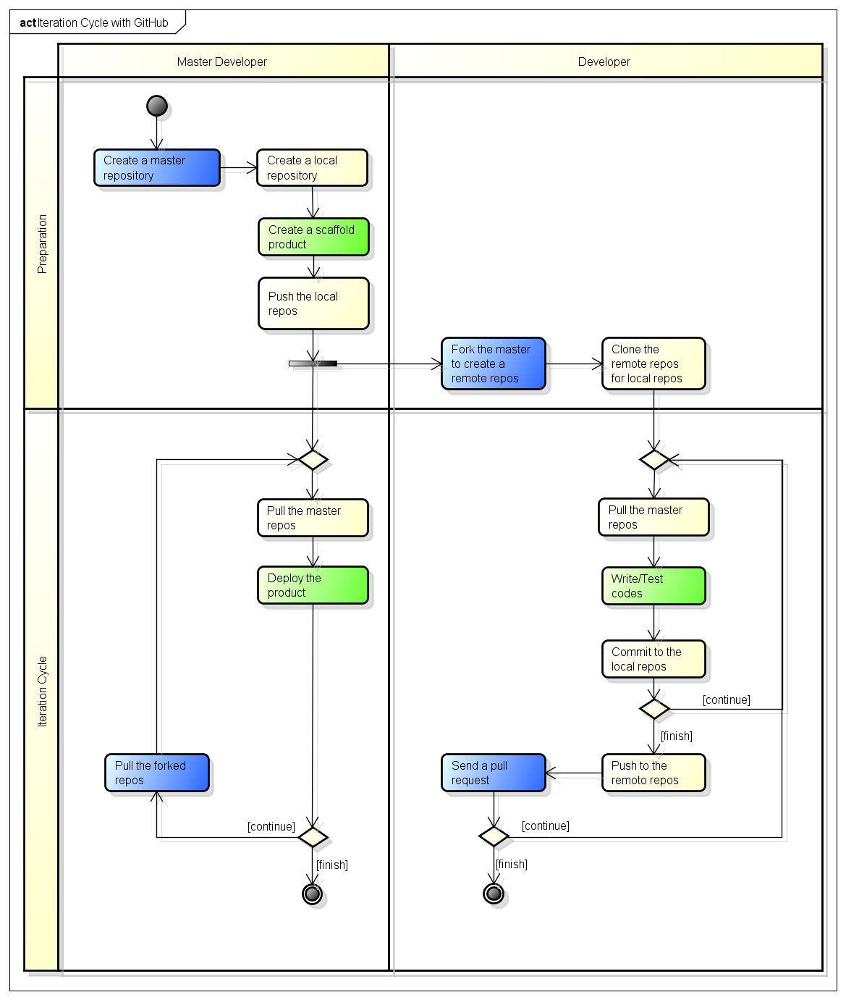

チームでまわすイテレーション
============================

イテレーションサイクルの概要
----------------------------

GitHub型開発モデル
------------------

  ..                       you push
  .. your personal repo ------------------> your public repo
  ..       ^                                     |
  ..       |                                     |
  ..       | you pull                            | they pull
  ..       |                                     |
  ..       |                                     |
  ..       |               they push             V
  .. their public repo <------------------- their repo

.. todo:: GitHub型モデルの図を作成する

チケット駆動型開発（TkDD）
--------------------------

チケットとは，仕事に取りかかるために必要な切符のようなものです．TkDDでは，仕事をする前に，必ずチケットを発行しなくてはなりません．また，チケットは誰が読んでも仕事の内容が分かるものでなくてはなりません．このチケットをグループ内で有効に共有して，プロジェクトを進めるのがTkDDです．

チケットの「書き方」に関する大原則は次の通りです [#ticket]_ ．

- やらなければいけないことを網羅する
- 誰が見ても分かるようにかく
- タスクの終了条件をはっきりさせる
- 大きなタスクは処理しやすい大きさに分ける
- 進捗がわかるようにする（誰がやってるか？もう終わったか？）
- リストは定期的に見直す

これらに加えて，次のことを追加します．

- チケットは，メンバーが自ら発行できる（PMが発行しても **構わない** ）
- チケットは，メンバーが自らとりにいく（PMがアサインしても **構わない** ）

チームメンバー全員が，チケットを介して主体的に仕事の分担をするのが理想です．

※チケットの状況（進捗）は成績評価に反映させますので，必ずチケットを発行した上で仕事を始め，進捗があったらチケットの状態を変化させてください．

.. rubric:: 脚注

.. [#ticket] http://www.slideshare.net/Ryuzee/ss-9800501

チケットの共有
--------------

この演習では，GitHubのissueを使って，チケットを管理します．

ドキュメントの共有
------------------

ドキュメントは全てGitHubのWikiで共有します．

イテレーションサイクルのシナリオ
--------------------------------
.. image:: _static/GitHubWorkflow.png
   :width: 100%

.. TODO::

  図の修正：deployはDeveloper Aが行う

シナリオの説明
--------------

ここからはチームでの作業になります．

作業を始めるにあたり役割分担をします．まず，全てのメンバーはDeveloperです．加えて，メンバーのなかから一人「Merger」を決めてください．MergerはDeveloperを兼ねます．

以下のシナリオでは，次の3名からなるグループを想定します．

========  =================
Name      Role               
========  =================
doraemon  Developer, Merger
nobita    Developer          
shizuka   Developer          
========  =================

全てのメンバーはGitHubで互いをFollowしてください．

  - http://help.github.com/be-social/ 

作成するアプリケーション
------------------------

作成するアプリは「ブログアプリ」です．

レポジトリの準備（Mergerが行う作業）
------------------------------------

Create a scaffold product
~~~~~~~~~~~~~~~~~~~~~~~~~
Mergerは，次のコマンドで，Scaffoldを作成します．

.. code-block:: bash

  $ rails new blog
  $ cd blog
  $ rm public/index.html
  $ rails generate scaffold Post name:string title:string content:text
  $ rake db:migrate

デプロイの設定を行います．

.. code-block:: bash

  $ capify .

※前に作業したときと同様に，Capfile, config/deploy.shを書き換えます．

Create a local repo
~~~~~~~~~~~~~~~~~~~
Mergerは，ローカルのgitレポジトリにcommitします．

.. code-block:: bash

  $ git init
  $ git add .
  $ git commi -a -m 'Initial commit'

Push the repo
~~~~~~~~~~~~~

次に，GitHubにも新しいレポジトリ「blog」を作成します．

作成できたら，pushしてください．

.. code-block:: bash

  $ git remote add origin git@github.com:doraemon/blog.git
  $ git push -u origin master

レポジトリの準備（Developerが行う作業）
---------------------------------------

Fork the merger repo
~~~~~~~~~~~~~~~~~~~~
Developerは，GitHubにリモートレポジトリを作ります．

まず，Mergerが作成したレポジトリをGitHubから検索し，「Frok」します．

  - http://help.github.com/fork-a-repo/

同様に，Watchも設定してください

  - http://help.github.com/be-social/

clone the remote repo into local repo
~~~~~~~~~~~~~~~~~~~~~~~~~~~~~~~~~~~~~
DeveloperはGitHubにある **自分のレポジトリ** をcloneします．

.. code-block:: bash

  $ git clone git@github.com:nobita/blog.git
  $ cd blog
  $ git status     # <- check
  $ git remote -v     # <- check

※自分のレポジトリは'origin'という名前で参照できるようになります．

**Mergerのレポジトリ** のURLを登録します．

.. code-block:: bash

  $ git remote add doraemon git://github.com/doraemon/jobs.git
  $ git remote -v # <- check

イテレーション(Developer)
-------------------------

Pull the merger repo
~~~~~~~~~~~~~~~~~~~~
GitHubの **Mergerのレポジトリ** をpullします．

.. code-block:: bash

  $ git pull doraemon master

Write/Test codes
~~~~~~~~~~~~~~~~
まず，MergerのGitHubレポジトリのページにアクセスして，チケット（issue）を発行します．

※なお，チケットなしに作業をしたメンバーには，何らかのペナルティを科しましょう．

次に，作業（プログラミング）をします．

※はじめは，app/views/blogs/以下にある各*.html.erbファイルを，ファイル毎に分担して編集してみるのがよいでしょう．

慣れてきたら，プログラムに機能追加をしてみてください．次のblogアプリを開発するチュートリアルがありますので，必要に応じて参照してください．

  - http://guides.rubyonrails.org/getting_started.html

Commit to the local repo
~~~~~~~~~~~~~~~~~~~~~~~~
チケットに書いた作業が終わったら，ローカルレポジトリにコミットします．

.. code-block:: bash

  $ git add .
  $ git commit -a -m 'Closes #10'

2行目の#10のところは，作業したチケットの番号（issue number）に置き換えてください．こうすることで，後ほどMergerがマージの作業を終えたら自動的にチケットがクローズされます．

※ローカルレポジトリのコミットは，他のメンバーに影響しないので，こまめに実行しましょう [#svn]_ ．

.. [#svn] これが，従来のCVSやSVNの運用とは異なる点です．

Push to the remote repo
~~~~~~~~~~~~~~~~~~~~~~~
GitHubの **自分のレポジトリ** にpushします．

.. code-block:: bash

  $ git push origin master

※pushする前に，必ずテストとローカルサーバでの動作確認をしてください．実行時にエラーがでるようなコードをpushすると，他の人に迷惑がかかります．もし，単純な文法ミスなどの明らかなエラーを含むコードをpushした人には，何らかのペナルティを科しましょう．

Send a pull request
~~~~~~~~~~~~~~~~~~~
Mergerにpullを要求します

  - http://help.github.com/send-pull-requests/

以上で，イテレーション終了です．

作業中，Mergerが他のDeveloperのコードをマージした可能性があるので，6.11.1に戻って作業を継続します．

イテレーションサイクル(Merger)
------------------------------

Pull the merger repo
~~~~~~~~~~~~~~~~~~~~
Mergerのレポジトリをpullします．

.. code-block:: bash

  $ git pull origin master

Deploy the product
~~~~~~~~~~~~~~~~~~
サーバにdeployします．

.. code-block:: bash

  $ cap deploy

Merge pull requests
~~~~~~~~~~~~~~~~~~~
DeveloperからのpullリクエストをMergeします．

https://github.com/blog/843-the-merge-button

エラー無くMergeできたら，6.12.1に戻ります．

Solve conflicts
~~~~~~~~~~~~~~~
Mergeする際，コンフリクトが発生して，オートマージできない場合があります．コンフリクトは，複数のDeveloperが同じ箇所を，別の内容に変更した場合に生じます．この場合は，手動で解消することになります．

この作業を行うためには，まず，MergerがDeveloperのレポジトリを登録しておきます．

.. code-block:: bash

  $ git remote add shizuka git://github.com/sizuka/jobs.git

コンフリクトが発生したら，Developerのレポジトリから新しいコードを取得します．

.. code-block:: bash

  $ git fetch shizuka
  $ git merge shizuka

ここで，コンフリクトの内容が確認できるので，適宜修正します（どっちかを活かして，どっちかを消します）．

完了したら，commitしてpushします．

.. code-block:: bash

  $ git add .
  $ git commit -a -m 'Merged'
  $ git push origin master

6.12.2に戻ります．

進捗報告
--------

授業開始後，適切なタイミングで進捗報告会を開催してください．

進捗報告会は，次の作業が終わった後に行います．

#. Developerは，チケットの一覧を確認すること

  - クローズのし忘れはないか？
  - 残りの作業はなにか？
  - 新たなチケットの発行

  など

#. Developerは，自分の作業を確認し，commitすること

  - テストは通るか？
  - テスト用サーバで動作するか？

#. Mergerは，Pull Requestに対応し，そこまでできたソフトウェアをdeployすること

  - メンバー全員で確認できるようにする
  - 教員にも見せられるようにする

.. Local Variables:
.. compile-command: "(cd .. && make html)"
.. End:
