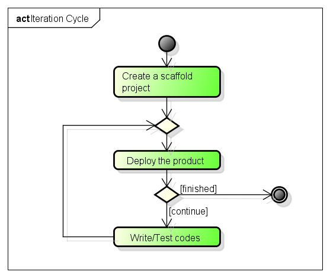

概要
========================================

授業の目標
----------------------------------------

少人数のチームで，イテレーションサイクルを回すことができるようになることが目標です．演習では，Ruby on Railsを利用し，全員が同じ環境で作業をします．作成するプログラムは簡単なものですので，Rubyになれているかどうかの違いはあまり気にならないはずです．目標はあくまでもイテレーションサイクルを回してみることです．

演習の進め方
----------------------------------------

Stage 1: イテレーションを一人でまわす
~~~~~~~~~~~~~~~~~~~~~~~~~~~~~~~~~~~~~~~~

はじめに，自分のマシンに開発環境を構築し，一人でイテレーションを回してみます．イテレーションサイクルは次の図に示す通りです．

Stage 2: イテレーションをチームでまわす
~~~~~~~~~~~~~~~~~~~~~~~~~~~~~~~~~~~~~~~~

次に，サーバを構築し，チームでイテレーションを回してみます．ここでは，GitHubを使った共同開発をします．

なお，チーム編成は，Stage 1を終わった順にアサインしていきます．

Stage 3: 基幹システムを開発する
~~~~~~~~~~~~~~~~~~~~~~~~~~~~~~~
最後に，冗長性や可用性，拡張性などを備えたシステムをチームで開発します．

- DBサーバのクラスタリング
- Webアプリケーションサーバのクラスタリング
- ロードバランサの導入
- 仮想化

.. 授業の日程
.. ----------
.. #. 12/08
.. #. 12/15
.. #. 12/22
.. #. 01/12
.. #. 01/19
.. #. 01/26
.. #. 02/02
.. #. 02/09

.. スケジュール
.. ------------

.. 第1回の授業は，個人が作業するためのWorkstation環境を構築し，Stage 1を開始します．Stage 1が終わったら，担当者の確認を受けてください．

.. 第2回の授業から，Stage 1が終わった人順にチームを編成し，Stage 2に移ります．グループの中でイテレーションサイクルを回してみましょう．作成するアプリケーションについては，担当者が指示をします．

.. 第3回の授業以降，Stage 3で何をするかをグループで相談し，実際の作業に移ります．なお，Stage 2と3の間で，グループを再編成する可能性があります．

.. 第4回以降の計画は，各グループで立案してください．

.. 第8回では，グループで行った作業内容について報告してもらいます．

.. Stage 3まで進んだら，チーム内でお好きな技術を使って開発してみてください．

.. なお，Stage 2とStage 3との間で，チームを組み替える可能性があります．

.. Local Variables:
.. compile-command: "(cd .. && make html)"
.. End:
